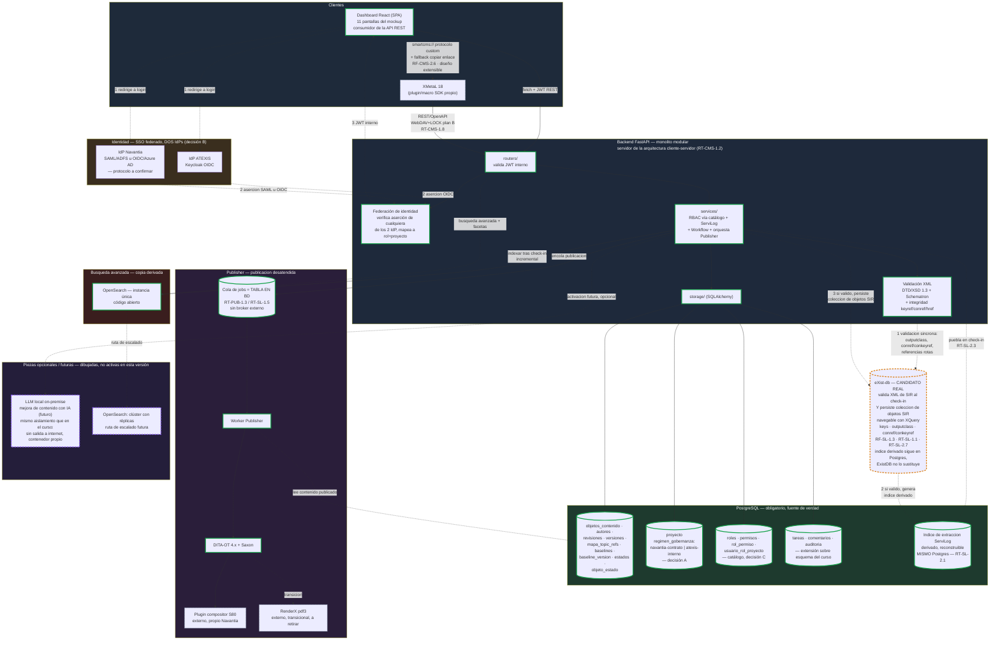

# Arquitectura completa — Proyecto CCMS-Nav

Diagrama y justificación de la arquitectura completa del CCMS de Navantia 
(S80), partiendo de la arquitectura ya validada en `fase-4-arquitectura-
sistemas/2-ejercicio_arquitectura_ccms.md` del curso, adaptada donde los 
requisitos reales (`Requisitos Bloque CCMS v01.docx`), el mockup 
(`Mockup CCMS S80 v04.html`) y las 5 decisiones de 
`especificacion/tensiones_pendientes_tras_aacf_analisis.md` lo exigen.

No es un diseño nuevo desde cero: reutiliza el criterio ya defendido en el 
curso (monolito modular, PostgreSQL como fuente de verdad, motores externos 
solo como copias derivadas y reconstruibles) y lo extiende con las piezas 
que este proyecto real necesita y que el curso no cubrió.

## Diagrama de arquitectura completa

### Leyenda del marcado visual

RT-CMS-1.2 exige explícitamente *"Arquitectura cliente-servidor y código 
abierto"*. Es un requisito **general sobre la forma del sistema completo**, 
no una instrucción sobre cómo se conecta ningún cliente concreto — se 
desarrolla en detalle en "Backend FastAPI — monolito modular" más abajo. El 
marcado por color de este diagrama evalúa **solo la plataforma que este 
proyecto construye o licencia** — no las herramientas externas de Navantia 
con las que simplemente se integra.

- **Borde verde sólido — código abierto, construido por este proyecto**: 
  FastAPI, SQLAlchemy, PostgreSQL, React, DITA-OT + Saxon (Apache 2.0), y 
  **OpenSearch** (no Elasticsearch) — todo lo que RT-CMS-1.2 gobierna.
- **Borde gris discontinuo — herramienta externa, RT-CMS-1.2 no aplica**: 
  **XMetaL 18** (asunción externa preexistente, AS-CCMS-1), el **plugin 
  compositor S80** y **RenderX (pdf3)**. Confirmado: las tres son 
  herramientas de Navantia fuera del alcance del software que este 
  proyecto desarrolla o licencia — mismo tratamiento que XMetaL, sin 
  connotación de incumplimiento. RenderX sigue señalado además como 
  *"en transición"* en el propio docx: candidato a retirarse cuando el 
  compositor S80 lo sustituya por completo, no una pieza a mantener a 
  largo plazo.
- **Borde violeta discontinuo — pieza opcional/futura, sin caso de uso 
  concreto todavía**: el **LLM local** y el **clúster de OpenSearch** (ver 
  más abajo) — dibujadas y justificadas, sin ser parte del alcance actual.
- **Borde ámbar discontinuo — candidato real, con caso de uso concreto ya 
  identificado en los requisitos, pendiente de decisión de adopción**: 
  **eXist-db** (ver "Persistencia de objetos SIR en eXist-db" más abajo) — a 
  diferencia del violeta, esta pieza ya tiene evidencia textual del docx 
  que la sustenta, no es solo un patrón heredado del curso sin caso de uso 
  propio.

## Justificación por pieza

### Backend FastAPI — monolito modular, arquitectura cliente-servidor (RT-CMS-1.2)

Reutilizado tal cual del curso: `fase-4-arquitectura-sistemas/
2-ejercicio_arquitectura_ccms.md` ya defendió, con cita al checkpoint de 
`fase-1-backend/README.md`, que un CCMS de este tamaño no necesita 
microservicios — el criterio (ciclo de despliegue, escalado y equipo 
distintos) sigue aplicando aquí sin cambios.

**Aquí es donde se cumple RT-CMS-1.2, y solo aquí — a nivel de sistema 
completo, no de ninguna pieza concreta.** RT-CMS-1.2 tiene dos cláusulas 
independientes:

- **"Arquitectura cliente-servidor"**: se cumple por construcción del 
  sistema en su conjunto — el backend FastAPI es el servidor único; el 
  Dashboard React, XMetaL (y en el futuro Oxygen) son los clientes que lo 
  consumen vía REST. No es una propiedad de ningún cliente individual ni 
  de cómo se lanza cada uno.
- **"Código abierto"**: se cumple de forma agregada por las piezas que 
  este proyecto construye o licencia (backend, base de datos, motor de 
  búsqueda, dashboard, tooling XML — ver leyenda del diagrama), no por 
  ninguna pieza aislada.

**Importante, para no repetir la confusión**: la decisión de CÓMO se 
conecta un cliente concreto (p. ej. XMetaL vía `smartcms://`, vía un 
agente local, o vía WebDAV+LOCK como plan B) es una **decisión de 
integración de editor** — gobernada por RF-CMS-2.6 y RT-CMS-1.8 (ver 
"Integración con XMetaL" más abajo) — completamente independiente de si 
el sistema, como un todo, es cliente-servidor o de código abierto. Esa 
propiedad ya está garantizada por este apartado, se conecte XMetaL como 
se conecte.

### PostgreSQL — esquema base + extensiones de este proyecto

El núcleo (`objetos_contenido`, `autores`, `revisiones`, `versiones`, 
`mapa_topic_refs`, `baselines`, `baseline_version`, `estados`, 
`objeto_estado` — las 9 entidades del diagrama entidad-relación) es el 
esquema de `fase-2-bases-de-datos/2-construccion_esquema_bd.md` sin 
modificar — el propio docx confirma que 
encaja: RT-CMS-1.3 ("persistencia por objeto, no por elemento") y RF-CMS-
3.1 ("modelo CCMS clásico: revisiones + estados") son exactamente el patrón 
ya construido en el curso.

Se añaden tres piezas nuevas, todas dentro del mismo PostgreSQL:
- **`proyecto`** (con `regimen_gobernanza`): estructura obligatoria de la 
  decisión A de tensiones — detalle completo en "Aislamiento 
  multi-proyecto/multi-cliente (decisión A)" más abajo.
- **Catálogo RBAC** (`roles`, `permisos`, `rol_permiso`, 
  `usuario_rol_proyecto`): decisión C — roles y permisos como datos, no 
  como constantes, porque la lista de roles todavía no está cerrada.
- **`tareas`, `comentarios`, `auditoria`**: el esquema del curso no 
  modelaba una entidad de tarea que agrupe varios objetos con asignación/
  reclamación (Gestor de tareas del mockup, RF-CMS-7.3), ni comentarios 
  (RF-CMS-7.5), ni un log de auditoría de acciones distinto del historial 
  de contenido (`revisiones`) — el panel de Administración → Auditoría del 
  mockup y RF-CMS-9.x lo piden explícitamente.

### Índice de extracción de ServiLog — copia derivada, pero DENTRO de Postgres

ServiLog no es un servicio ni un almacén aparte: RT-SL-1.1 dice 
explícitamente que *"se implementa con los objetos DITA reutilizables 
(mismo storage y versionado que el resto)"* — los objetos SIR (warning, 
part, tool…) son simplemente otra familia de `objetos_contenido`, sin 
tabla ni servicio propio.

Lo que sí es una pieza nueva es el **índice de extracción** (RT-SL-2.1 a 
2.7): un almacén relacional que alimenta los 7 extractos Excel (§2.B del 
docx) y las consultas de trazabilidad (where-used) de ServiLog. Sigue el 
mismo principio de "copia derivada, nunca fuente de verdad, reconstruible" 
que Elasticsearch en el curso — pero el propio requisito (RT-SL-2.1: 
*"alojado en la base de datos del propio CCMS"*) exige que viva **en el 
mismo PostgreSQL**, no en un motor externo. Por eso, a diferencia de 
Elasticsearch/OpenSearch, no aparece como servicio aparte en el diagrama.

### Persistencia de objetos SIR en eXist-db — candidato, copia derivada FUERA de Postgres

**eXist-db: candidato real que valida el XML fuente de los objetos SIR Y 
persiste una copia de ellos — no solo un validador de paso.** A diferencia 
del índice de extracción (sección anterior), que vive dentro del mismo 
Postgres, la colección de objetos SIR de eXist-db —si se activa— es un 
motor externo aparte. Los objetos SIR (warning, caution, part, tool, 
lubricant…) no son datos planos — viven como XML DITA con semántica 
estructural propia, confirmado por tres requisitos concretos del docx:

- **RF-SL-1.3**: *"Reutilización por conref/conkeyref a nivel de dato, fila 
  o tabla desde los ditamaps de dosier."* `conref`/`conkeyref` son 
  mecanismos que solo operan sobre elementos XML — confirma que el SIR es 
  contenido estructurado, no un registro plano.
- **RT-SL-1.1**: *"ServiLog se implementa con los objetos DITA reutilizables 
  (mismo storage y versionado que el resto)."* — explícito: los objetos SIR 
  son objetos DITA como cualquier topic.
- **RT-SL-2.7**: *"ningún valor del índice puede depender de heurísticas 
  sobre el texto visible del documento... Todo dato indexado procede de una 
  key, de un atributo o de un identificador semántico."* — el índice debe 
  derivarse de construcciones estructurales XML (keys, atributos, 
  identificadores semánticos como `part-001-pn`), no de texto plano.

Es exactamente el mismo tipo de necesidad que `fase-2-bases-de-datos/
4-ejercicio_xmlBD.md` y la corrección de la Pregunta 3 de la ronda de 
abogado del diablo en `fase-4-arquitectura-sistemas/
2-ejercicio_arquitectura_ccms.md` identificaron como la justificación real 
de eXist-db — controlar y validar keys/referencias cruzadas DITA, navegar 
la estructura para detectar enlaces rotos — solo que allí era un caso de 
uso hipotético, y aquí es un requisito textual concreto: validar el 
contrato de tabla N2 (outputclass + identificadores semánticos de fila/
celda) y resolver keyref/conref del SIR antes de que esos valores se 
vuelquen al índice relacional.

**El matiz que fija dónde van las flechas en el diagrama**: RT-SL-2.1 ya 
deja cerrado que el índice derivado en sí vive en PostgreSQL — eso no 
cambia, y eXist-db no sustituye esa tabla ni convive con ella como almacén 
alternativo para el índice. Pero eXist-db sí guarda su propia copia de los 
objetos SIR, en un flujo de tres pasos:

1. **Validación síncrona al check-in** (`ValidXML -.-> ExistDB`): 
   `ValidXML` (donde ya vive la validación DTD/XSD/Schematron/keyref/
   conref/href) envía el XML del objeto SIR a eXist-db, que comprueba el 
   contrato de tabla N2 (outputclass + identificadores semánticos de fila/
   celda) y que conref/conkeyref resuelven sin referencias rotas.
2. **Si es válido, se genera el índice derivado** (`ExistDB -.-> Indice`): 
   los valores estructurales validados alimentan el índice de extracción 
   en PostgreSQL (RT-SL-2.1 a 2.7) — igual que antes.
3. **Si es válido, se persiste también el objeto SIR en eXist-db** 
   (`Services -.-> ExistDB`): la colección de objetos SIR queda navegable 
   con XQuery para consultas posteriores por etiqueta/key/estructura — el 
   caso de uso original que motivó eXist-db (buscar keywords, controlar 
   variables DITA) y que una validación puramente de paso, sin guardar 
   nada, no cubría.

Si el check-in NO es válido, se rechaza en el paso 1 y no se persiste nada 
ni en el índice ni en eXist-db. La colección de eXist-db sigue siendo 
**copia derivada y reconstruible desde PostgreSQL** (mismo patrón que 
OpenSearch) — PostgreSQL sigue siendo la fuente de verdad de los objetos 
SIR; si la colección de eXist-db se corrompiera, se reconstruye 
reindexando desde ahí. El alcance es limitado, no "todo o nada": solo los 
objetos SIR de ServiLog llevan esta copia — el resto del contenido (topics 
normales, ditamaps) sigue el patrón ya cerrado de PostgreSQL como única 
fuente, sin copia en eXist-db.

**Cómo se consulta**: los objetos SIR se consultan contra eXist-db con 
XQuery (mismo patrón de ejemplo ya construido en `fase-2-bases-de-datos/
4-ejercicio_xmlBD.md` — FLWOR sobre `collection()`, navegando estructura 
real), no con `LIKE` sobre PostgreSQL, que no entiende estructura ni 
distingue atributo de texto. El resto del contenido sigue resolviendo 
búsqueda por texto libre vía OpenSearch, como ya estaba decidido.

Queda marcada como **candidato real, no activa todavía** (borde ámbar en el 
diagrama): la necesidad está identificada y justificada con texto concreto 
del docx, pero activarla es una decisión de implementación pendiente, igual 
que en el curso — no se añade complejidad sin que el caso de uso esté 
claro, y aquí ya lo está. Esta es una corrección de **rol** (qué haría 
eXist-db si se activa), no de **estatus** (sigue sin activarse).

### OpenSearch (no Elasticsearch) — búsqueda avanzada

La pantalla "Búsqueda avanzada" del mockup muestra relevancia (barra de 
score), fragmentos resaltados y facetas combinadas (tipo/estado/
aplicabilidad) — el mismo problema que `fase-2-bases-de-datos/
5-ejercicio_busquedas.md` ya identificó como el que PostgreSQL no resuelve 
bien (sin ranking de relevancia, sin fuzzy). Se mantiene como copia 
derivada, indexada de forma incremental tras cada check-in, exactamente 
igual que en la arquitectura del curso.

**Cambio deliberado frente al curso**: se elige **OpenSearch**, no 
Elasticsearch — decisión cerrada. El propio `5-ejercicio_busquedas.md` 
documenta que Elasticsearch dejó de ser open source según el estándar OSI 
en 2021, y que OpenSearch es el fork bajo Apache 2.0: dado que RT-CMS-1.2 
exige código abierto explícitamente, Elasticsearch (licencia Elastic/SSPL) 
contradiría ese requisito directamente; OpenSearch no.

**Dimensionamiento**: para esta versión, **instancia única** — a la escala 
que fija RT-CMS-1.11 (20 usuarios concurrentes, miles de objetos, no 
millones), un clúster con réplicas añade complejidad operativa sin un 
problema de disponibilidad real que lo justifique todavía. El clúster con 
réplicas (mismo patrón de alta disponibilidad ya defendido en 
`fase-4-arquitectura-sistemas/2-ejercicio_arquitectura_ccms.md` para 
Elasticsearch en producción) queda dibujado en el diagrama como **ruta de 
escalado futura**, no como parte activa — se activa el día que el volumen 
real o un requisito de disponibilidad medido lo justifiquen, sin cambiar 
nada del resto de la arquitectura (OpenSearch sigue siendo copia derivada, 
reconstruible desde PostgreSQL, tenga una instancia o un clúster detrás).

### Publisher — cola en BD, sin broker externo

RT-PUB-1.3 y RT-SL-1.5 son explícitos: *"Cola = tabla en BD"*. A diferencia 
del patrón Celery/RQ mencionado de forma genérica en el checkpoint de la 
Fase 1 del curso (que normalmente implica un broker externo tipo Redis), 
aquí el propio requisito técnico fija la cola como una tabla — más simple, 
sin una pieza de infraestructura adicional que mantener, y sin entrar en 
la incertidumbre de licencia que ha tenido Redis en los últimos años. El 
worker consume esa tabla y ejecuta DITA-OT 4.x + Saxon (RT-PUB-1.2, código 
abierto, construidos por este proyecto), que invocan el plugin compositor 
S80 (RT-PUB-1.4) y, de forma transicional, RenderX (pdf3) — ambos, 
herramientas externas de Navantia (ver leyenda), y RenderX además señalado 
como pieza a retirar, no a mantener.

### Validación XML — ampliada frente al curso

En el curso, la validación XML (lxml) era una pieza "pendiente de añadir", 
identificada pero no detallada. Aquí los requisitos son mucho más 
específicos y se documentan tal cual: RT-CMS-1.6 exige un validador 
"DITA-aware" (DTD/XSD 1.3 + resolución de catálogos OASIS + integridad de 
keys/conref, "que valida igual que el editor"), y AS-CCMS-3/RF-CMS-4.2 
añaden validación de negocio con Schematron, ejecutable tanto desde el 
editor XML durante la autoría como, después, desde el propio CCMS en el 
check-in. Un check-in inválido se rechaza sin crear versión (RF-CMS-4.3).

### Integración con XMetaL — más específica que el patrón genérico del curso

**Nota previa**: esta sección decide *cómo* se lanza y se comunica XMetaL 
con el backend — una decisión de integración de editor. No tiene relación 
con RT-CMS-1.2 (arquitectura cliente-servidor y código abierto), que ya 
queda satisfecho a nivel de sistema completo en "Backend FastAPI — 
monolito modular" más arriba, independientemente de qué mecanismo se elija 
aquí.

El curso proponía un "agente local" (aplicación auxiliar corriendo en 
segundo plano, con su propio servidor HTTP local) para lanzar cualquier 
editor externo desde el navegador. **Este proyecto no necesita esa pieza**: 
RF-CMS-2.6 especifica un mecanismo más simple y ya estándar en el sector — 
un **protocolo de URL personalizado** (`smartcms://`, registrado en el 
sistema operativo del autor) que el sistema operativo resuelve lanzando 
XMetaL directamente, con "copiar enlace" como fallback si el protocolo no 
está registrado en esa máquina. XMetaL habla con el backend vía plugin/
macro SDK propio sobre REST/OpenAPI (RT-CMS-1.8), con WebDAV+LOCK como plan 
B — protocolo que XMetaL soporta de serie, sin necesitar ninguna pieza 
intermedia adicional. Es una integración más directa que la del curso 
precisamente porque XMetaL, a diferencia de los editores genéricos que 
manejaba el ejercicio del curso, ya trae soporte nativo para WebDAV+LOCK.

**Extensibilidad a futuros editores (ya aplicada, no una tarea pendiente)**: 
RF-CMS-2.1 exige que la integración "sea compatible con otros editores", y 
AS-CCMS-1 menciona la migración a Oxygen XML Author como valor futuro. El 
protocolo `smartcms://` ya está diseñado como capa de lanzamiento genérica 
(un protocolo de SO + un contrato REST/OpenAPI en el backend), no atada a 
XMetaL — el mismo contrato sirve para el plugin de Oxygen el día que se 
adopte, sin rediseño. No hace falta ninguna acción adicional ahora para 
sostener esto.

**Mejora posible, no urgente**: el patrón de nombres de las rutas/URLs del 
protocolo (hoy ad-hoc, ej. `smartcms://checkout/<id>`) podría 
estandarizarse más adelante con una convención más consistente (verbo + 
recurso + parámetros, versionado del propio esquema de URL) a medida que 
crezcan los casos de uso — queda anotado como mejora futura, no como 
acción a tomar en esta fase de diseño.

### SSO federado con dos IdP (decisión B)

Pieza completamente nueva frente al curso, que solo contemplaba un IdP 
(Active Directory/Azure AD). Aquí el backend necesita un componente de 
**federación de identidad** que acepte aserciones de cualquiera de los dos 
IdP (ATEXIS/Keycloak OIDC, Navantia con protocolo aún por confirmar) y las 
mapee a un JWT interno único, con el rol y el proyecto/régimen de 
gobernanza aplicables — más complejo que el flujo SSO de un solo IdP que sí 
bastaba en el ejercicio del curso.

**IdP de Navantia: dos escenarios posibles, ambos preparados de antemano.** 
El docx no especifica el protocolo de Navantia — en vez de dejarlo como una 
incógnita sin desarrollar, se documentan aquí las dos opciones reales del 
sector (ya investigadas en `fase-4-arquitectura-sistemas/README.md`, 
"Cómo funciona SSO con Active Directory, paso a paso"), para que la 
decisión de implementación esté lista en cuanto Navantia confirme cuál usa:

- **Opción 1 — SAML vía ADFS clásico (Active Directory Federation 
  Services on-premise)**: típico en infraestructura de defensa/industrial 
  más veterana. `AuthFed` recibiría una aserción SAML (XML firmado 
  digitalmente) tras una redirección al ADFS de Navantia, verificaría la 
  firma con el certificado público intercambiado de antemano con IT de 
  Navantia, y extraería los grupos AD del usuario para mapearlos a roles 
  internos. Requiere la librería `python3-saml` en el backend (mismo 
  patrón ya documentado en el curso) y el registro previo del CCMS como 
  Service Provider ante el ADFS de Navantia (Entity ID + certificado).
- **Opción 2 — OAuth2/OIDC vía Azure AD/Microsoft Entra ID**: si Navantia 
  ha migrado su identidad a la nube. `AuthFed` recibiría directamente un 
  ID token OIDC ya construido (sin necesidad de parsear una aserción 
  SAML), vía la librería `Authlib`. Requiere un Client ID/secreto 
  registrado en el tenant de Azure AD de Navantia, y es más simple de 
  implementar en un stack FastAPI moderno que la opción SAML.

En ambos casos, el resultado que le llega al resto del sistema es el mismo: 
`AuthFed` normaliza cualquiera de las dos aserciones a un JWT interno único 
con rol y régimen de gobernanza — el resto del backend (`Routers`, 
`Services`) no necesita saber qué protocolo usó Navantia. Esto permite 
empezar a construir `AuthFed` con el IdP de ATEXIS (Keycloak OIDC, ya 
conocido) y añadir el adaptador de Navantia como una pieza intercambiable 
en cuanto se confirme cuál de las dos opciones aplica.

### LLM local — opcional, dibujado pero no activo en esta versión

Ni el mockup ni el docx piden ninguna función de mejora de contenido con 
IA para este proyecto — a diferencia de la arquitectura del curso, donde sí 
formaba parte del alcance. En vez de omitirlo por completo, se mantiene 
**dibujado y justificado, marcado como opcional/futuro**, con el mismo 
tratamiento visual que recibió eXist-db en 
`fase-4-arquitectura-sistemas/2-ejercicio_arquitectura_ccms.md`: presente 
en el diagrama, conectado con línea punteada, pero fuera del alcance activo.

Si en el futuro se añade una función de este tipo (p. ej. sugerir mejoras 
de redacción sobre un topic, resumir cambios entre baselines de forma más 
rica que el resumen automático ya previsto en RF-PUB-1.6), esta es la pieza 
que se activaría — siguiendo exactamente el mismo patrón de aislamiento ya 
defendido en el curso: contenedor Docker propio, con acceso a GPU si hace 
falta, **sin salida a internet**, aceptando conexiones solo desde el 
backend en red interna. No requiere ningún cambio de arquitectura para 
activarse, solo levantar el contenedor y conectar `Services` a él.

### Aislamiento multi-proyecto/multi-cliente (decisión A)

Se resuelve en el modelo de datos, no en la UI: toda tabla de contenido 
cuelga de `proyecto`, y `proyecto.regimen_gobernanza` determina qué reglas 
de gobernanza (contrato Navantia vs. política interna ATEXIS) aplican a 
ese contenido. La búsqueda (OpenSearch) y los reports de integridad deben 
resolverse por proyecto, nunca cruzando proyectos por defecto — esto no se 
representa como una pieza nueva en el diagrama, sino como una restricción 
que atraviesa todas las piezas de datos.

## Mapeo funcionalidad del mockup → pieza de backend

| Funcionalidad (pantalla del mockup) | Pieza de backend responsable |
|---|---|
| Navegador del proyecto (árbol multinivel + filtros) | `Services` + `objetos_contenido` (Postgres) |
| Detalle de topic (metadatos/aplicabilidad/referencias/historial/comentarios/XML) | `Services` + `revisiones`, `mapa_topic_refs`, `comentarios` |
| Editor de bookmap (estructura drag-and-drop) | `Services` + `mapa_topic_refs` |
| Versiones, baselines y ramas (+ diff) | `versiones`, `baselines`, `baseline_version` (Postgres) |
| Gestor de tareas (asignación/reclamación, workflow, stepper) | `tareas`, `objeto_estado`, `estados` (Postgres) + RBAC |
| Publicación (Publisher, cola de jobs) | `PublisherBox` (cola en BD + worker + DITA-OT) |
| ServiLog (catálogo SIR, listados, trazabilidad, historial) | `Services` (ServiLog) + `objetos_contenido` + Índice de extracción (+ eXist-db, candidato, valida y persiste XML de SIR) |
| Búsqueda avanzada (facetas + relevancia) | OpenSearch |
| Reports & integridad (enlaces rotos, huérfanos, cobertura) | `ValidXML` + Índice de extracción |
| Administración (usuarios/roles/auditoría/config estándar) | Catálogo RBAC + `auditoria` (Postgres) |
| Login | `AuthFed` + los dos IdP |

## Verificación

El diagrama se renderizó con `mermaid-cli` antes de documentarlo aquí, sin 
errores de sintaxis.
