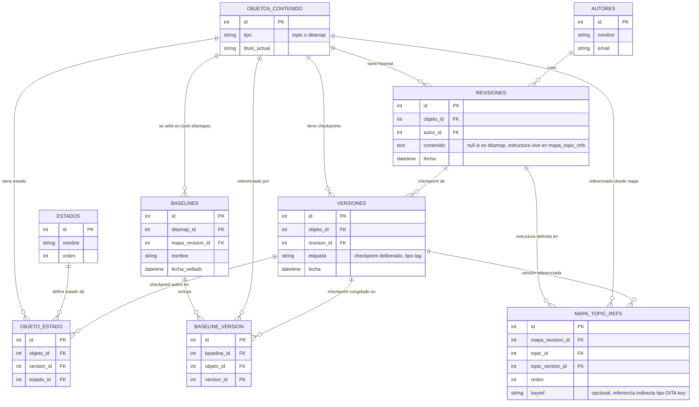

# Construcción del esquema de base de datos — Fase 2

Diseño paso a paso del esquema relacional para el CCMS, basado en la 
investigación de cómo lo resuelven IXIASoft, Heretto y Bluestream (ver 
README.md de esta fase).

## Glosario técnico: PK y FK

- **PK (Primary Key / clave primaria)**: columna que identifica de forma única 
  cada fila de una tabla (normalmente `id`). No puede repetirse ni estar vacía 
  — es el "DNI" de cada fila.
- **FK (Foreign Key / clave foránea)**: columna que apunta al PK de otra tabla, 
  estableciendo la relación entre ambas. Ej: `Revisiones.objeto_id` (FK) 
  apunta al `id` (PK) de una fila concreta en `Objetos_contenido`. Cada flecha 
  del diagrama Mermaid se implementa en SQL como una FK.

## Renombrado de conceptos (aclaración importante)

- **Versión**: checkpoint deliberado de un objeto de contenido individual 
  (topic o mapa) — equivalente a un "tag" en Git: marca una revisión concreta 
  como significativa, sin crear nada nuevo estructuralmente.
- **Revisión**: cada guardado genera una revisión (historial append-only, solo 
  INSERT, nunca UPDATE/DELETE). El contenido real (texto/XML) vive en la 
  columna `contenido` de esta tabla — `Objetos_contenido` solo guarda la 
  identidad (id, tipo, título de referencia), nunca el contenido en sí. Mismo 
  modelo mental que Git: el archivo persiste, el contenido vive en cada commit.

## Simplificación: se elimina Producto/Release

Se descartó tener tablas separadas `Producto` y `Release` como contenedores de 
agrupación de versiones de manual. Razón: esa agrupación ya la da el propio 
ditamap a través de sus revisiones y de `mapa_topic_refs` — un ditamap ES, en 
DITA real, la definición de "qué manual es este, con qué topics, en qué orden". 
Tener una tabla de negocio aparte para expresar lo mismo duplicaría la 
información.

- La "V1 del manual" y la "V2 del manual" son, técnicamente, dos revisiones 
  distintas del mismo ditamap.
- Una **Baseline** cubre lo que antes cubría "Release publicada": congela una 
  revisión concreta de un ditamap, con todo lo que `mapa_topic_refs` dice para 
  esa revisión (qué topics, en qué versión cada uno).
- El único caso no cubierto por esta simplificación es el branching paralelo 
  puro (dos revisiones del mismo ditamap coexistiendo activamente publicadas a 
  la vez, cada una con su propio ciclo de correcciones en paralelo) — caso 
  considerado poco frecuente frente al flujo normal de evolución lineal del 
  manual.

`Objeto_Release` se simplifica a `Objeto_Estado`: guarda el estado de workflow 
(borrador/revisión/publicado) de cada objeto individual y su versión/checkpoint 
activo, sin depender de ningún contenedor de Release superior.

## Generalización: topics y ditamaps comparten el mismo mecanismo

Un ditamap (`.ditamap`) es, igual que un topic, un archivo XML que se edita, 
se guarda (revisiones) y tiene checkpoints deliberados (versiones) — mismo 
patrón investigado en Heretto, donde mapas y topics se tratan como "recursos" 
con el mismo mecanismo de historial y versionado.

Diferencia real: un ditamap no es solo contenido de texto — su función es 
referenciar y ordenar otros topics (y otros mapas, de forma anidada).

### Decisión de diseño: entidad genérica compartida

En vez de duplicar el sistema de revisiones/versiones/estados/baselines para 
topics y mapas por separado, se creó una entidad genérica `objetos_contenido` 
(con campo `tipo`: topic o ditamap), y todo el mecanismo apunta a esta tabla 
genérica. Para ditamaps específicamente, existe la tabla `mapa_topic_refs`.

### La tabla mapa_topic_refs

Responde a: "en esta revisión concreta del mapa, ¿qué topics contiene, en qué 
orden, y con qué versión/checkpoint de cada uno?"

Cada fila conecta: una revisión de mapa concreta (`mapa_revision_id`), un 
topic referenciado (`topic_id`), la versión/checkpoint concreto de ese topic 
(`topic_version_id`), el orden dentro del mapa, y opcionalmente una `keyref` 
(referencia indirecta tipo DITA key/keyref, vista en la investigación de 
IXIASoft).

Ejemplo: la Revisión #5 del mapa "Manual de instalación" referencia: Topic A 
(su Versión #2), Topic B (su Versión #1), Topic C (su Versión #4), en ese 
orden. Si se actualiza el Topic B a un nuevo checkpoint sin tocar el mapa, la 
Revisión #5 del mapa sigue apuntando exactamente a las mismas versiones — nada 
cambia por accidente. Solo editar el mapa deliberadamente crea una Revisión #6 
con las referencias actualizadas. Reproduce el comportamiento documentado en 
Heretto: restaurar un mapa a una versión anterior no restaura automáticamente 
los topics que contiene.

## Baselines: ligadas directamente al ditamap

Una baseline es una fotografía congelada e inmutable de una revisión concreta 
de un ditamap (equivalente al "Snapshot" de IXIASoft/Bluestream). Se relaciona 
con un `objeto_contenido` de tipo ditamap y su `mapa_revision_id`, y para cada 
topic referenciado en esa revisión del mapa, `Baseline_Version` guarda qué 
Versión (checkpoint) de cada topic estaba activa — no la revisión directamente, 
porque una baseline congela checkpoints deliberados, no guardados intermedios 
sueltos.

## Mecanismo de branching (ramificar un ditamap y sus topics)

Branchear no significa duplicar todo de golpe — el coste real depende de 
cuánto diverge el contenido.

### Paso 1: crear el branch del ditamap (barato)
1. Se crea un `objeto_contenido` nuevo (nuevo id, tipo=ditamap): esta es la 
   identidad del branch.
2. Se crea su primera Revisión, con una copia del XML de la revisión original 
   que se está ramificando.
3. Se rellena `mapa_topic_refs` para esta nueva revisión apuntando a los 
   MISMOS topics, en las MISMAS versiones exactas que el ditamap original — no 
   se duplican los topics, solo se referencian igual que antes.

En este punto el branch existe pero cuesta casi nada: es solo una nueva 
"cabecera" de ditamap apuntando a contenido idéntico y compartido.

### Paso 2: divergencia real (solo cuando hace falta)
Si en el branch se edita un topic de forma distinta al original:
- **Si solo una de las dos líneas (original o branch) sigue tocando ese topic 
  a partir de ahora**: se crea una nueva Revisión/Versión normal de ese topic, 
  y se actualiza `mapa_topic_refs` del ditamap que lo edita para apuntar a la 
  nueva versión. La otra línea sigue apuntando a la versión antigua sin verse 
  afectada — las referencias son siempre a una versión concreta, nunca "a la 
  última".
- **Si ambas líneas necesitan seguir editando el mismo topic de forma 
  independiente y divergente**: hace falta "forkear" también ese topic (crear 
  un nuevo `objeto_contenido` para él), porque una única línea de revisiones 
  no puede representar dos futuros distintos a la vez.

Esto reproduce el patrón investigado en IXIASoft: solo se ramifica un topic 
cuando necesita divergir de verdad. Branchear el ditamap es barato (una fila 
nueva + referencias compartidas); solo divergen (nuevo objeto_contenido) los 
topics concretos que lo necesiten, no todos por sistema.

## Diagrama entidad-relación

## Pendiente de decidir
- Definición completa de tipos de datos y restricciones (NOT NULL, UNIQUE, 
  CHECK) de cada columna
- Cómo se relaciona el usuario/rol (autor, revisor, publisher) con permisos 
  sobre estados concretos en `objeto_estado`
- Si conviene un `Proyecto` simple y opcional como agrupación laxa de topics y 
  mapas (sin peso estructural en el resto del esquema, solo organizativo)
