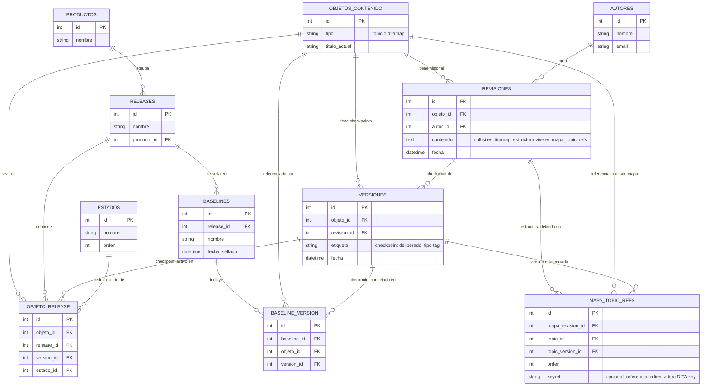

# Construcción del esquema de base de datos — Fase 2

Diseño paso a paso del esquema relacional para el CCMS, basado en la 
investigación de cómo lo resuelven IXIASoft, Heretto y Bluestream (ver 
README.md de esta fase).

## Renombrado de conceptos (aclaración importante)

Durante el diseño se detectó una ambigüedad: la palabra "versión" se estaba 
usando para dos conceptos distintos que en realidad viven en niveles 
diferentes. Se renombra así:

- **Release**: el contenedor de release de producto (ej. "Versión 1 del manual", 
  con su propio branching) — antes llamado "Versión" en las primeras notas de 
  este documento.
- **Versión**: ahora significa un checkpoint deliberado de un objeto de 
  contenido individual (topic o mapa) — equivalente a un "tag" en Git: marca 
  una revisión concreta como significativa, sin crear nada nuevo 
  estructuralmente.
- **Revisión**: sin cambios — cada guardado genera una revisión (historial 
  append-only, solo INSERT, nunca UPDATE/DELETE).

## Por qué existen tres niveles: Revisión, Versión, Release

Ejemplo real de flujo de trabajo en un editor tipo Oxygen:
1. Un autor edita un topic y guarda varias veces mientras trabaja → cada 
   guardado genera una **Revisión** nueva (guardado fino, continuo).
2. En un momento dado, decide que ese estado es un punto significativo → se 
   marca esa revisión como una **Versión** (checkpoint deliberado, tipo tag).
3. Esa versión del topic vive dentro de una **Release** de producto (ej. 
   "Manual V2"), donde además tiene un estado de workflow (borrador, en 
   revisión, publicado).

### Nota importante: por qué las revisiones importan incluso sin cambiar de Release

Las revisiones no existen solo para saltar entre releases de producto — 
permiten que el trabajo de un autor quede guardado (guardados intermedios 
mientras escribe, o el resultado de aplicar una mejora sugerida por el LLM) 
sin necesidad de generar una nueva Release. El historial detallado de cambios 
puede crecer dentro de la misma Release; solo cuando se marca un checkpoint 
(Versión) y se decide moverlo a otra Release, se actualiza la fila 
correspondiente en Objeto↔Release.

## Generalización: topics y ditamaps comparten el mismo mecanismo

Un ditamap (`.ditamap`) es, igual que un topic, un archivo XML que se edita, 
se guarda (revisiones) y tiene checkpoints deliberados (versiones) — el mismo 
patrón que ya se investigó en Heretto, donde mapas y topics se tratan como 
"recursos" con el mismo mecanismo de historial y versionado.

Diferencia real: un ditamap no es solo contenido de texto — su función es 
referenciar y ordenar otros topics (y otros mapas, de forma anidada). Esa 
estructura no la tiene un topic normal.

### Decisión de diseño: entidad genérica compartida (Opción A)

En vez de duplicar todo el sistema de revisiones/versiones/releases/baselines 
para topics y para mapas por separado, se crea una entidad genérica 
`objetos_contenido` (con un campo `tipo`: topic o ditamap), y todo el 
mecanismo ya diseñado apunta a esta tabla genérica. Para los ditamaps 
específicamente, se añade la tabla `mapa_topic_refs`.

Ventaja: todo el sistema de revisiones/versiones/baselines se escribe una sola 
vez y sirve para topics, mapas, y cualquier futuro tipo de objeto DITA (ej. 
imágenes). Alineado con cómo lo hacen los CCMS reales.

### La tabla mapa_topic_refs

Responde a la pregunta: "en esta revisión concreta del mapa, ¿qué topics 
contiene, en qué orden, y con qué versión/checkpoint de cada uno?"

Cada fila conecta: una revisión de mapa concreta (`mapa_revision_id`), un 
topic referenciado (`topic_id`), la versión/checkpoint concreto de ese topic 
que usa esa referencia (`topic_version_id`), el orden dentro del mapa (importa 
para la publicación final), y opcionalmente una `keyref` (la referencia 
indirecta tipo DITA key/keyref vista en la investigación de IXIASoft).

Ejemplo: la Revisión #5 del mapa "Manual de instalación" referencia: Topic A 
(su Versión #2), Topic B (su Versión #1), Topic C (su Versión #4), en ese 
orden. Si mañana se actualiza el Topic B a un nuevo checkpoint pero no se 
toca el mapa, la Revisión #5 del mapa sigue apuntando exactamente a las 
mismas versiones que apuntaba antes — nada cambia por accidente. Solo editar 
el mapa deliberadamente crea una Revisión #6 con las referencias actualizadas. 
Esto reproduce el comportamiento documentado en Heretto: restaurar un mapa a 
una versión anterior no restaura automáticamente los topics que contiene.

## Baselines: ligadas a Release y a Versión (no a Revisión)

Una baseline es una fotografía congelada e inmutable de una Release en un 
momento concreto (equivalente al "Snapshot" visto en la investigación de 
IXIASoft/Bluestream). Se relaciona con una Release, y para cada objeto de 
contenido dentro de esa Release, referencia la Versión (checkpoint) que 
estaba activa — no la revisión directamente, porque una baseline debe 
congelar checkpoints deliberados, no guardados intermedios sueltos.

## Diagrama entidad-relación

## Pendiente de decidir
- Definición completa de tipos de datos y restricciones (NOT NULL, UNIQUE, 
  CHECK) de cada columna
- Tabla `productos`: solo esbozada (id, nombre) — definir si necesita más 
  metadatos
- Cómo se relaciona el usuario/rol (autor, revisor, publisher) con permisos 
  sobre estados concretos en `objeto_release`
