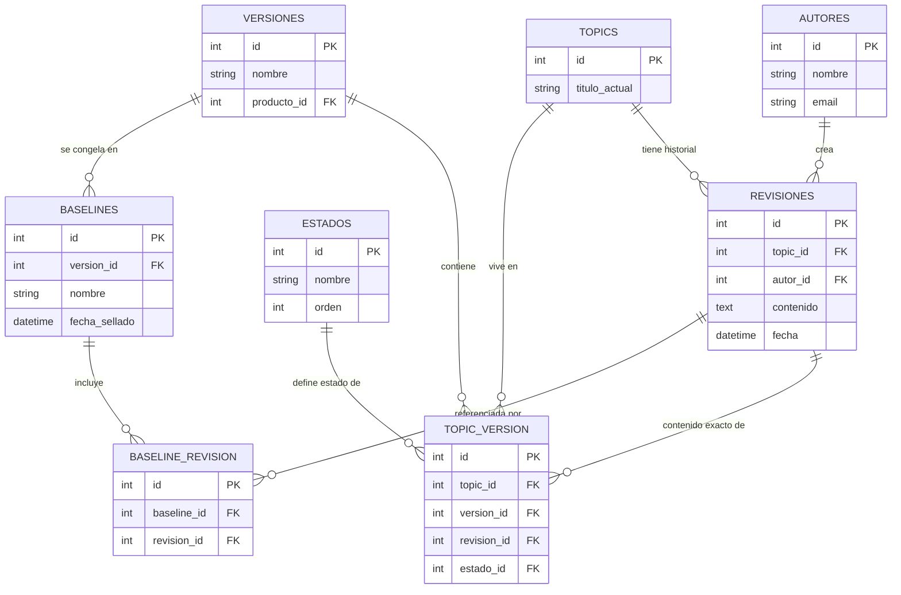

# Construcción del esquema de base de datos — Fase 2

Diseño paso a paso del esquema relacional para el CCMS, basado en la 
investigación de cómo lo resuelven IXIASoft, Heretto y Bluestream (ver 
README.md de esta fase).

## Entidades identificadas

1. **Autores**: quién escribe/edita contenido
2. **Topics**: el contenido en sí
3. **Versiones**: contenedor lógico de una línea de producto/release
4. **Estados** (tabla de catálogo): valores predefinidos del workflow 
   (borrador, en revisión, publicado...) — evita texto libre repetido, permite 
   añadir/modificar estados en un solo sitio, y colgar metadatos como orden 
   del flujo
5. **Topic↔Versión** (tabla relacional many-to-many): un topic puede vivir en 
   varias versiones a la vez sin duplicarse
6. **Revisiones**: historial append-only (solo INSERT, nunca UPDATE/DELETE) de 
   cada cambio de contenido de un topic — independiente de en qué versión esté 
   viviendo ese topic
7. **Baselines**: fotografía congelada e inmutable de una versión en un 
   momento concreto (ej. "estado exacto de la Versión 2 el día de entrega al 
   cliente") — equivalente al concepto de "Snapshot" visto en la investigación 
   de IXIASoft/Bluestream
8. **Baseline↔Revisión**: qué revisión concreta de cada topic forma parte de 
   una baseline (Opción A de diseño: se referencia la revisión exacta, no se 
   duplica contenido — más ligero, y seguro porque las revisiones son 
   inmutables)

## El punto clave: cómo se conectan versión y revisión

Son dos ejes distintos que se cruzan en la tabla Topic↔Versión:
- **Revisión** = historial de cambios de contenido de UN topic, propio de ese 
  topic, independiente de las versiones (como un "Ctrl+Z" lineal).
- **Versión** = a qué línea de producto pertenece un topic ahora mismo, con 
  qué estado.

La tabla Topic↔Versión no apunta solo al topic en abstracto: apunta a la 
**revisión concreta** que corresponde a esa combinación exacta de topic+versión. 
Por eso incluye `revision_id`, además de `topic_id`, `version_id` y `estado_id`.

### Ejemplo paso a paso

1. Se crea el Topic X → se crea la Revisión #1 (contenido inicial) → fila en 
   Topic↔Versión: (Topic X, Versión 1, Revisión #1, estado=publicado)
2. Se necesita cambiar el Topic X solo para la Versión 2, sin tocar la V1 → 
   se crea la Revisión #2 (contenido modificado) → se añade una fila NUEVA en 
   Topic↔Versión: (Topic X, Versión 2, Revisión #2, estado=borrador)
3. Ambas filas coexisten sin pisarse: la V1 sigue mostrando el contenido 
   original (Revisión #1); la V2 muestra el contenido cambiado (Revisión #2).

Resumen: la versión dice DÓNDE vive el topic ahora; la revisión dice QUÉ 
contenido exacto tiene ahí. La tabla Topic↔Versión conecta ambos ejes.

### Nota importante: por qué las revisiones importan incluso sin cambiar de versión

Las revisiones no existen solo para saltar entre versiones — son importantes 
porque permiten que el trabajo de un autor quede guardado (por ejemplo, 
guardados intermedios mientras escribe, o el resultado de aplicar una mejora 
sugerida por el LLM) sin necesidad de generar una nueva versión del producto. 
Se puede tener un historial detallado de cambios dentro de la misma versión, 
y solo la fila de Topic↔Versión se actualiza para apuntar a la revisión más 
reciente — no hace falta "subir de versión" para cada guardado.

## Diagrama entidad-relación

## Pendiente de decidir
- ¿Una baseline cuelga de una única versión concreta, o puede mezclar topics 
  de distintas versiones?
- Definición completa de tipos de datos y restricciones (NOT NULL, UNIQUE, 
  etc.) de cada columna
- Tabla `productos` (mencionada como producto_id en Versiones pero aún no 
  diseñada)
