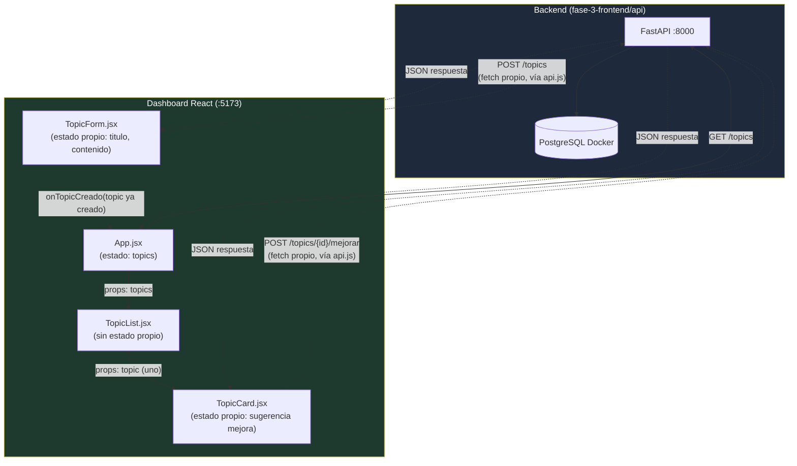

# Fase 3 — Frontend

## Resumen

En esta fase se trabaja el desarrollo del lado cliente: HTML, CSS, JavaScript avanzado, frameworks/librerías de UI, gestión de estado y consumo de APIs.

## Checklist de conceptos clave

- [ ] (pendiente de definir)

## Conceptos clave

### HTML/CSS/JS: lo mínimo para leer, no para escribir de cero
La Fase 0 ya cubrió lo esencial (fetch(), el navegador ejecutando JS de forma 
nativa). El objetivo de esta fase es dirigir a Claude Code con criterio, no 
competir escribiendo líneas de JS a mano.

### Frameworks: React vs Vue vs Angular
Los tres resuelven el mismo problema (interfaces dinámicas) con filosofías 
distintas:
- **React**: el más usado, ecosistema enorme, mucha demanda de mercado.
- **Vue**: curva de aprendizaje más suave, sintaxis más cercana a 
  HTML/CSS tradicional.
- **Angular**: más "empresarial" y rígido, con más estructura impuesta de 
  fábrica — habitual en grandes corporaciones con equipos grandes que 
  necesitan convenciones estrictas.

Para un panel de administración interno de tamaño medio, React o Vue son las 
opciones razonables — Angular añadiría rigidez innecesaria para este tamaño 
de proyecto.

### Arquitectura por componentes
La interfaz se construye como piezas reutilizables e independientes (un 
botón, una tarjeta de topic, una tabla de resultados), cada una con su propio 
estado y lógica. Misma filosofía que la reutilización de topics en DITA — un 
componente de UI, como un topic, se escribe una vez y se usa en muchos 
sitios.

### Gestión de estado
"Estado" es cualquier dato que cambia y que la interfaz necesita reflejar 
(¿está el formulario abierto? ¿qué topics se han cargado? ¿hay un error?). 
Para casos simples, `useState` de React basta. Cuando ese estado necesita 
compartirse entre componentes lejanos entre sí (ej. "qué usuario está 
logueado" necesitándose en el header, el formulario y el pie de página a la 
vez), aparecen herramientas más avanzadas de gestión de estado — no 
necesario en la primera versión de este dashboard.

### SPA vs renderizado tradicional
Una SPA (Single Page Application) carga una sola vez y luego actualiza solo 
las partes que cambian, usando fetch() para traer datos nuevos sin recargar 
toda la página — el mismo patrón visto en la Fase 0. El modelo tradicional 
(páginas PHP clásicas, por ejemplo) recarga la página completa en cada clic. 
React construye SPAs por defecto.

## Ejercicio

Dashboard en React que consume un backend con persistencia real en PostgreSQL 
(mismo esquema y misma base de datos `ccms` que la Fase 2), con tres 
funciones: listar topics, crear un topic nuevo, y disparar la mejora mock de 
un LLM sobre un topic concreto.

### Estructura

```
fase-3-frontend/
├── api/                    # copia del backend de fase-2-bases-de-datos/api
│                            # (idéntico byte a byte salvo main.py, ver nota CORS)
└── dashboard/               # frontend en React (Vite)
    └── src/
        ├── api.js                    # única capa que llama a fetch()
        ├── App.jsx                   # estado compartido: la lista de topics
        └── components/
            ├── TopicForm.jsx          # formulario para crear un topic
            ├── TopicList.jsx          # pinta la lista (sin estado propio)
            └── TopicCard.jsx          # una tarjeta + su botón "mejorar"
```

### Sobre la copia del backend (`api/`)

Es una copia de `fase-2-bases-de-datos/api`, confirmada idéntica con `diff -r` 
antes de tocar nada. El único cambio posterior fue añadir CORS en `main.py`: 
en fase-1/fase-2 la API solo se había probado con curl/Swagger (mismo origen 
que el propio backend); un dashboard corriendo en el navegador desde otro 
puerto (Vite, `5173`) necesita que el backend permita explícitamente 
peticiones cross-origin, o el navegador las bloquea por política de mismo 
origen — el mismo concepto de CORS ya visto en la Fase 0. Routers, services, 
storage, models y el resto quedan exactamente igual que en fase-2.

### Qué endpoint consume cada componente

| Componente | Endpoint | Cuándo |
|---|---|---|
| `App.jsx` | `GET /topics` | Al cargar la página (una vez, en `useEffect`) |
| `TopicForm.jsx` | `POST /topics` | Al enviar el formulario |
| `TopicCard.jsx` | `POST /topics/{id}/mejorar` | Al pulsar "Mejorar con IA (mock)" en esa tarjeta |

### Estado, datos del backend y presentación, componente por componente

- **`App.jsx`** — Estado propio (`useState`): `topics`, `cargando`, `error`. 
  Vive aquí porque tanto `TopicList` (para pintarlo) como `TopicForm` (para 
  añadirle el topic recién creado) lo necesitan — es "levantar el estado" al 
  ancestro común. Datos del backend: `topics` se rellena en el `useEffect` 
  con la respuesta real de `GET /topics`; a partir de ahí es estado de React 
  que se actualiza localmente (`handleTopicCreado`) sin volver a preguntarle 
  al backend. Presentación: el layout (`<header>`, dos columnas) no decide 
  nada, solo organiza dónde va cada hijo.

## Aclaración: dónde vive exactamente el fetch()

App.jsx no escribe fetch() directamente — llama a funciones importadas desde 
api.js (ej. `obtenerTopics()`), que son las que contienen el fetch() real. Es 
una capa de organización adicional: en vez de escribir 
`fetch("http://localhost:8000/topics")` dentro de cada componente, se 
centraliza en un archivo aparte (api.js), y los componentes solo llaman a 
funciones con nombre claro (obtenerTopics, crearTopic, mejorarTopic).

Es el mismo patrón de separación de capas ya visto en el backend: api.js es, 
en el frontend, el equivalente de storage/ en el backend — la única pieza que 
sabe hablar con el exterior (aquí, con la API HTTP vía fetch), mientras que 
App.jsx (como routers/services) solo usa funciones con nombre, sin 
preocuparse del detalle de cómo se hace la petición por debajo.

Contenido real de `api.js`:

```javascript
// Capa de acceso a la API: el único archivo que sabe la URL del backend y
// usa fetch() directamente. Mismo motivo que separar storage/ en el backend
// (Fase 1): si mañana cambia la URL, el puerto, o cómo se autentica la
// petición, solo hay que tocar este archivo — los componentes no llaman a
// fetch() nunca directamente, llaman a estas funciones.
const API_URL = "http://localhost:8000";

// GET /topics — trae la lista completa de topics. La usa App.jsx al cargar.
export async function obtenerTopics() {
  const respuesta = await fetch(`${API_URL}/topics`);
  if (!respuesta.ok) {
    throw new Error("No se pudieron cargar los topics");
  }
  return respuesta.json();
}

// POST /topics — crea un topic nuevo. La usa TopicForm.jsx al enviar el formulario.
export async function crearTopic(titulo, contenido) {
  const respuesta = await fetch(`${API_URL}/topics`, {
    method: "POST",
    headers: { "Content-Type": "application/json" },
    body: JSON.stringify({ titulo, contenido }),
  });
  if (!respuesta.ok) {
    throw new Error("No se pudo crear el topic");
  }
  return respuesta.json();
}

// POST /topics/{id}/mejorar — pide la sugerencia mock del LLM para un topic
// concreto. La usa TopicCard.jsx al pulsar "Mejorar con IA (mock)".
export async function mejorarTopic(id) {
  const respuesta = await fetch(`${API_URL}/topics/${id}/mejorar`, {
    method: "POST",
  });
  if (!respuesta.ok) {
    throw new Error("No se pudo generar la sugerencia de mejora");
  }
  return respuesta.json();
}
```

- **`TopicList.jsx`** — Sin estado propio (no hay ningún `useState`). Datos 
  del backend: recibe `topics` entero como prop desde `App`; no vuelve a 
  pedir nada. Presentación: 100% JSX de pintado — su único "código" es un 
  `.map()` para convertir cada topic en un `<TopicCard>`.

- **`TopicCard.jsx`** — Datos del backend (prop `topic`): `id`, `titulo`, 
  `contenido`, ya cargados por `App`. Estado propio (`useState`): 
  `sugerencia`, `mejorando`, `error` — resultado transitorio de pulsar 
  "Mejorar" en ESA tarjeta concreta; no existen en el backend ni en ningún 
  otro componente, por eso viven aquí y no en `App`. Presentación: el 
  `<article>`, títulos y párrafos — solo muestran lo que ya está en 
  props/estado.

- **`TopicForm.jsx`** — Estado propio (`useState`): `titulo`, `contenido` 
  (lo que el usuario va escribiendo, no existe todavía en el backend), más 
  `enviando`/`error` para ese envío concreto. No recibe datos del backend 
  (es quien los envía). Presentación: los `<input>`/`<textarea>`/`<button>` 
  pintan el valor actual del estado y notifican cambios, sin decidir nada 
  por su cuenta. Al terminar, avisa a `App` vía `onTopicCreado` — no sabe ni 
  le importa cómo se muestra la lista.

### Cómo levantar la API (`fase-3-frontend/api`)

```bash
cd fase-3-frontend/api
python -m venv venv
source venv/bin/activate      # en Windows: venv\Scripts\activate
pip install -r requirements.txt
python crear_tablas.py        # crea las tablas en 'ccms' si no existen (idempotente)
uvicorn main:app --reload
```

La API queda en `http://localhost:8000` (mismo contenedor Docker 
`ccms-postgres` de la Fase 2 — ver `fase-2-bases-de-datos/1-README.md`).

### Cómo levantar el dashboard (`fase-3-frontend/dashboard`)

```bash
cd fase-3-frontend/dashboard
npm install
npm run dev
```

El dashboard queda en `http://localhost:5173`. Con la API corriendo en el 
`8000`, la página carga los topics existentes, permite crear uno nuevo, y 
generar la sugerencia mock de mejora sobre cualquiera de ellos.

## Archivos generados automáticamente por Vite

Al crear el proyecto con Vite (`npm create vite@latest`), se generan 
automáticamente varios archivos de infraestructura, no escritos a mano como 
parte de la lógica del dashboard. Documentados aquí para referencia:

- **main.jsx**: punto de entrada real de la aplicación. Engancha el 
  componente App.jsx al HTML real (index.html) con 
  `ReactDOM.createRoot(...).render(<App />)`. Estándar, casi nunca se toca.
- **index.html**: único archivo HTML real de todo el dashboard (es una SPA). 
  Contiene un `<div id="root"></div>` prácticamente vacío donde main.jsx 
  inyecta toda la aplicación React — todo lo visible se genera dinámicamente 
  por JavaScript dentro de ese div.
- **vite.config.js**: configuración de Vite, la herramienta que compila y 
  sirve el código React en desarrollo (lo que arranca con `npm run dev` y da 
  la URL localhost:5173). Equivalente, en el mundo frontend, a lo que uvicorn 
  es para el backend.
- **package.json**: equivalente exacto de requirements.txt en Python, pero 
  para JavaScript/Node.js — lista las dependencias del proyecto (React, y 
  cualquier librería usada) y sus versiones. Define también comandos como 
  `npm run dev`.
- **package-lock.json**: registra las versiones exactas de cada dependencia 
  y sus propias sub-dependencias, para garantizar instalaciones idénticas en 
  cualquier máquina. No se edita a mano — se genera y actualiza solo al 
  instalar/actualizar paquetes.
- **.oxlintrc.json**: configuración de un linter (herramienta que revisa el 
  código en busca de errores comunes o estilo inconsistente, sin ejecutarlo). 
  Oxlint es una alternativa moderna y rápida a ESLint. No imprescindible para 
  que el dashboard funcione, pero ayuda a detectar errores mientras se 
  escribe código.

## Diagrama de arquitectura del dashboard



Cómo leerlo: las flechas sólidas representan datos bajando por props (padre → 
hijo). Las flechas punteadas representan peticiones a la API o eventos que 
suben (hijo → padre).

**Matiz importante frente al patrón "App centraliza todo el fetch"**: solo 
`GET /topics` lo hace App.jsx. `TopicForm` y `TopicCard` hacen su **propio** 
`fetch()` a la API (vía `api.js`), no le piden a App que lo haga por ellos:

- `TopicForm` llama a `crearTopic()` directamente, y solo cuando el `POST` ya 
  ha terminado con éxito, avisa a App vía `onTopicCreado(nuevoTopic)` — le 
  pasa el topic ya creado, no le pide crearlo.
- `TopicCard` llama a `mejorarTopic()` directamente y guarda el resultado en 
  su propio estado (`sugerencia`). **No tiene ninguna prop de tipo callback 
  hacia App** — no existe un `onMejorar`, porque ninguna otra parte de la 
  interfaz necesita saber si esa tarjeta concreta está mostrando una 
  sugerencia.

En React esto es igual de válido que centralizarlo todo en el ancestro común: 
el criterio para decidir quién hace el fetch es si el resultado necesita 
compartirse con otros componentes (como `topics`, que sí sube a App) o si es 
puramente local a un componente (como la `sugerencia` de una tarjeta, que no 
sube a ningún sitio).

## Aclaración: qué es cada pieza (React, Vite, y quién habla con el backend)

Es fácil confundir estas tres piezas al principio, así que conviene 
precisarlas:

- **React** no es un "ecosistema de librerías" — es, en sí mismo, una 
  librería (la pieza central para construir componentes y gestionar estado 
  con useState, etc.). Sí tiene un ecosistema enorme alrededor (librerías 
  adicionales que se combinan según necesidad), pero React en sí es una sola 
  librería con un propósito concreto: construir interfaces con componentes.
- **Vite** no es un "servidor para comunicarse con el backend" — es una 
  herramienta de desarrollo y compilación (build tool): sirve el código React 
  al navegador durante el desarrollo (de ahí la URL localhost:5173), 
  recompila y recarga automáticamente al guardar cambios (hot reload), y 
  empaqueta el código para producción con `npm run build`. Vite nunca habla 
  con FastAPI ni con el backend — es, del lado frontend, el mismo papel que 
  Uvicorn cumple del lado backend: hace posible ver el código corriendo, 
  nada más.
- **Quien sí habla con FastAPI** es el propio código JavaScript, dentro del 
  navegador — las llamadas fetch() organizadas en api.js. Cuando App.jsx hace 
  fetch("http://localhost:8000/topics"), eso corre DENTRO del navegador, no 
  dentro de Vite — Vite ya cumplió su función (servir el código) mucho antes 
  de que esa llamada ocurra.

### Mapa completo, cada pieza en su sitio

| Pieza | Qué es | Con quién habla |
|---|---|---|
| **React** | Librería para construir componentes e interfaces | No habla con nada por sí sola — es solo lógica de UI |
| **Vite** | Herramienta de desarrollo/compilación (como Uvicorn, pero para frontend) | Sirve el código al navegador; no habla con el backend |
| **Código JS propio (fetch() en api.js)** | El puente real hacia el backend | Habla con FastAPI vía HTTP, desde dentro del navegador |
| **FastAPI** | El backend | Recibe esas peticiones HTTP, habla con PostgreSQL |

### La cadena completa

Vite sirve el código React al navegador → el navegador ejecuta ese código → 
el propio JavaScript (no Vite) hace fetch() hacia FastAPI → FastAPI responde 
→ React actualiza la pantalla con esos datos.

## Cómo distinguir estado, props y presentación (con código real)

Tres preguntas rápidas para identificar cada parte de un componente:

1. **¿Viene entre `{ }` en la firma de la función del componente** (ej. 
   `function TopicCard({ topic })`)? → Es **props**: datos que vienen del 
   componente padre, que a su vez normalmente vinieron de una llamada fetch() 
   al backend. El componente no los genera, solo los recibe y los muestra.

2. **¿Se declaró con `useState`?** → Es **estado**: algo que cambia con el 
   tiempo, propio de ese componente, que al cambiar hace que React vuelva a 
   pintar la pantalla para reflejarlo.

3. **¿Es solo una etiqueta JSX que muestra texto fijo o estructura, sin ser 
   ninguna de las dos anteriores?** → Es **presentación pura**: no tiene 
   lógica propia, solo pinta o captura una interacción (como un onClick) que 
   dispara algo definido en otro sitio.

### Ejemplo 1: props (pregunta 1) — `TopicCard.jsx`, líneas 20 y 40-41

```jsx
function TopicCard({ topic }) {           // ← props: "topic" viene entre { }
  // ...
  return (
    <article className="topic-card">
      <h3>{topic.titulo}</h3>              {/* ← props: solo lee topic.titulo */}
      <p>{topic.contenido}</p>             {/* ← props: solo lee topic.contenido */}
```

`topic` llega entre `{ }` en la firma de la función (pregunta 1: sí) → es 
props. `TopicCard` nunca genera `topic.titulo` ni `topic.contenido` por su 
cuenta — le llegaron ya resueltos desde `App` (que a su vez los obtuvo de 
`GET /topics`), y aquí solo se leen para pintarlos.

### Ejemplo 2: estado (pregunta 2) — `TopicCard.jsx`, líneas 21-23

```jsx
const [sugerencia, setSugerencia] = useState(null);
const [mejorando, setMejorando] = useState(false);
const [error, setError] = useState(null);
```

Las tres están declaradas con `useState` (pregunta 2: sí) → son estado. 
Ninguna llega por props ni existía antes de que el usuario interactuara con 
esta tarjeta: `sugerencia` empieza en `null` y solo cambia si se pulsa 
"Mejorar" y la API responde; `mejorando` alterna entre `true`/`false` 
mientras dura esa petición; `error` solo se rellena si la petición falla. Al 
cambiar cualquiera de las tres, React vuelve a pintar la tarjeta para 
reflejarlo (ej. el botón pasa a decir "Generando sugerencia...").

### Ejemplo 3: presentación pura (pregunta 3) — `TopicCard.jsx`, líneas 43-45

```jsx
<button onClick={handleMejorar} disabled={mejorando}>
  {mejorando ? "Generando sugerencia..." : "Mejorar con IA (mock)"}
</button>
```

No viene por props ni se declara con `useState` (pregunta 1 y 2: no) → es 
presentación pura. El `<button>` en sí no decide nada: solo lee el estado ya 
existente (`mejorando`) para mostrar un texto u otro y para desactivarse, y 
captura el clic (`onClick`) para disparar `handleMejorar`, una función 
definida más arriba en el propio componente — el botón no sabe qué hace esa 
función, solo que debe llamarla al pulsarlo.
