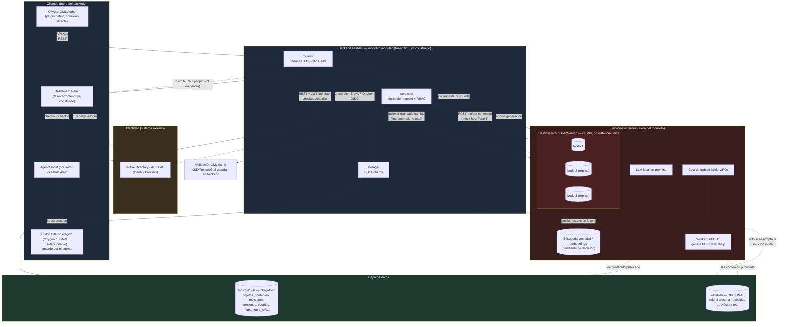
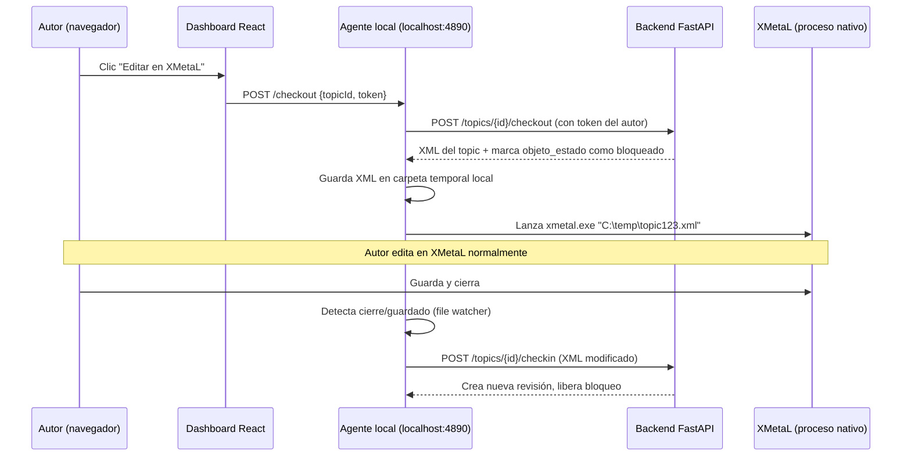
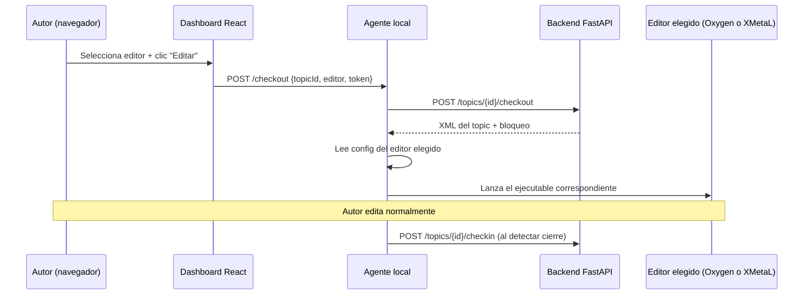

# Ejercicio de síntesis — Fase 4: arquitectura completa del CCMS

Diseño y defensa de la arquitectura completa del CCMS, integrando todo lo 
construido y documentado en las Fases 0-4. No es un diseño nuevo desde cero: 
es el ensamblaje de decisiones ya tomadas (y justificadas por escrito) en 
fases anteriores, más las piezas que faltaban (Oxygen, LLM real, DITA-OT, 
SSO) encajadas siguiendo esos mismos criterios.

## Diagrama de arquitectura completa



## Defensa de cada pieza, con cita explícita a la fase que la sustenta

### Backend FastAPI: monolito modular, no microservicios

**Decisión**: un único backend, organizado internamente en módulos 
(`services/topics_service.py`, y en el futuro `workflow_service.py`, 
`usuarios_service.py`...), no un enjambre de microservicios.

**Por qué**: es la conclusión textual del checkpoint de 
`fase-1-backend/README.md` ("Checkpoint resuelto: microservicios vs 
monolito modular"): *"Para un CCMS de tamaño medio, no hay suficiente 
volumen de rutas para justificar servicios independientes solo por eso. Un 
monolito modular resuelve la mayoría del sistema."* El mismo documento fija 
el criterio real (no el número de endpoints, sino: ¿ciclo de vida de 
despliegue distinto? ¿necesita escalar distinto? ¿lo mantiene un equipo 
distinto?), y ese criterio es el que se ha aplicado aquí para decidir qué 
vive dentro del monolito y qué vive fuera.

### Qué vive DENTRO del backend (mismo monolito)

Topics, autores, workflow, RBAC, validación JWT — todo lo que ya existe en 
`fase-1-backend/api` → `fase-2-bases-de-datos/api` → `fase-3-frontend/api` 
(la misma API, copiada y ampliada sin romper routers/services en cada 
fase, confirmado con `diff` en cada migración). Ninguna de estas piezas 
tiene un ciclo de despliegue distinto al resto: cambian con la misma 
frecuencia, las mantiene el mismo equipo, no necesitan escalar por separado.

### Qué vive FUERA del backend (servicios independientes)

Exactamente los tres candidatos que el propio checkpoint de 
`fase-1-backend/README.md` identificó por nombre:

- **LLM local on-premise**: *"si está desplegado on-premise, es casi por 
  definición un servicio independiente (requisitos de hardware propios, 
  ciclo de arranque propio); el backend lo consume vía API"*. Hoy es el mock 
  de `POST /topics/{id}/mejorar` (Fase 1); en producción sería la misma 
  llamada HTTP, pero contra un servicio real. Justifica además el requisito 
  de residencia de datos ya visto en `fase-4-arquitectura-sistemas/README.md` 
  ("Seguridad y residencia de datos"): mantenerlo on-premise es lo que 
  permite decir que ningún contenido sale de España vía LLM.
- **Motor de búsqueda (Elasticsearch/OpenSearch)**: *"servicio externo por 
  naturaleza, se indexa y consulta aparte del CRUD normal"* — confirmado de 
  nuevo en `fase-2-bases-de-datos/5-ejercicio_busquedas.md`, que llega a la 
  misma conclusión de forma independiente: *"el motor de búsqueda es uno de 
  los candidatos naturales a vivir fuera del backend principal... su ciclo 
  de vida (indexar, reindexar, escalar) es distinto al del resto del 
  sistema"*. Es siempre una copia derivada, nunca la fuente de verdad — 
  reconstruible desde PostgreSQL/eXist-db si se pierde.
- **Pipeline de publicación DITA-OT**: *"tarea pesada y lenta, caso de uso 
  típico de colas de trabajo (Celery/RQ) — un worker separado del proceso 
  web, para no bloquear otras peticiones mientras se genera un documento 
  largo"* (mismo checkpoint, y la sección "Procesamiento asíncrono / colas 
  de trabajo" de ese mismo README). El backend solo encola la tarea; el 
  worker DITA-OT la procesa en su propio proceso.

## Monolito modular vs microservicios: el criterio correcto, aplicado pieza por pieza

Surgida como respuesta a la Pregunta 5 de la ronda de abogado del diablo: el 
número de procesos corriendo no es el criterio — lo es cuánta lógica de 
negocio propia del CCMS está separada en servicios independientes.

### Repaso del criterio ya definido en el checkpoint de la Fase 1

"¿Tiene un ciclo de vida de despliegue distinto? ¿Necesita escalar de forma 
distinta al resto? ¿Lo mantiene un equipo distinto?" — con la conclusión de 
que los candidatos reales a vivir fuera del backend principal son el motor 
de búsqueda, el LLM local, y un worker separado para tareas largas.

### Aplicando el criterio a cada pieza de la arquitectura actual

- **PostgreSQL**: nunca contó como "microservicio" — es infraestructura de 
  datos, no lógica de negocio. Ningún backend "sin microservicios" corre sin 
  una base de datos separada del proceso de la app.
- **Elasticsearch (clúster)**: tecnología distinta por naturaleza (motor de 
  búsqueda, no lógica CRUD), con necesidad de escalar de forma independiente 
  (réplicas). Infraestructura de apoyo, igual que PostgreSQL.
- **LLM local**: requisitos de hardware (GPU) distintos al resto del 
  backend, ciclo de despliegue propio. No es lógica del CCMS separada 
  arbitrariamente — es una pieza que por naturaleza física no puede vivir en 
  el mismo proceso.
- **Worker DITA-OT + cola**: separado por rendimiento (tarea larga, no debe 
  bloquear peticiones web) — patrón Celery/RQ ya identificado en la Fase 1 
  como razón legítima de separación.
- **SSO/Active Directory**: ni siquiera es una pieza desplegada por este 
  proyecto — es infraestructura que ya existe en la empresa, previa al CCMS. 
  No cuenta como "servicio creado", es un sistema externo al que se conecta, 
  como cualquier proveedor externo.

### La pregunta que de verdad distingue microservicios de monolito modular

¿Dónde vive la lógica de negocio del CCMS — crear topics, gestionar workflow 
de revisión, aplicar permisos, versionar contenido? Toda esa lógica vive en 
un único backend FastAPI, organizado en módulos (routers/services/storage), 
tal como se construyó en las Fases 1-2. No hay un "servicio de topics" 
separado de un "servicio de versiones" separado de un "servicio de 
workflow" — eso sí sería microservicios, y es precisamente lo que se evitó.

### La distinción exacta

- **Microservicios**: dividir la lógica de negocio propia en procesos 
  independientes (un servicio de topics, otro de usuarios, otro de 
  workflow, cada uno con su propio backend y quizás su propia BD).
- **Monolito modular con infraestructura de apoyo separada**: una única 
  pieza de lógica de negocio (el backend FastAPI), rodeada de 
  infraestructura que por naturaleza técnica no puede o no debe vivir en el 
  mismo proceso (bases de datos, motores de búsqueda, hardware 
  especializado, sistemas de identidad externos).

Ningún proyecto monolítico corre sin una base de datos separada del proceso 
de la aplicación — eso nunca fue el debate. El debate era si se divide la 
lógica propia en piezas artificialmente separadas sin necesidad real. Según 
lo construido, no se ha hecho.

### Base de datos: PostgreSQL obligatorio, eXist-db opcional (no ahora)

**Decisión**: mantener el esquema de PostgreSQL ya construido 
(`fase-2-bases-de-datos/2-construccion_esquema_bd.md`) como única base de 
datos por defecto. **No** añadir eXist-db todavía.

**Por qué mantenerlo así por ahora**: `fase-2-bases-de-datos/4-ejercicio_xmlBD.md` 
lo dice explícitamente tras comparar ambos enfoques: *"no sustituir 
PostgreSQL por eXist-db por completo — se perdería la solidez relacional ya 
construida (revisiones, versiones, autores, estados), que es donde 
PostgreSQL es más fuerte."* El esquema de la Fase 2 (`objetos_contenido` + 
`revisiones` + `versiones` + `mapa_topic_refs` + `baselines`) ya resuelve, 
con SQL, el mismo problema de versionado a nivel de componente que 
investigamos en IXIASoft/Heretto/Bluestream — no hay ninguna necesidad 
identificada todavía (ni volumen de contenido, ni caso de uso real) que 
justifique añadir una segunda base de datos.

**Por qué queda como opción marcada, no descartada — argumento corregido 
(respuesta a la Pregunta 3 de la ronda de abogado del diablo)**: el motivo 
real para tenerla dibujada no es un caso de uso débil tipo "editar un título 
sin reescribir el documento completo" (eso, en PostgreSQL, es simplemente 
regrabar la columna `contenido` — coste bajo, no justifica una segunda base 
de datos). El motivo real y específico es **controlar y validar la 
coherencia de las referencias cruzadas de keys/variables DITA entre topics y 
mapas** (keyrefs, tal como se investigó sobre IXIASoft en la Fase 2 — ver 
`fase-2-bases-de-datos/1-README.md`), y **navegar la estructura XML para 
detectar enlaces rotos o aplicar condicionales DITA** (filtering/profiling 
por audience, platform, product). Son necesidades que exigen *entender* la 
estructura XML y sus referencias — algo que ni PostgreSQL (trata el XML como 
texto opaco en `revisiones.contenido`) ni Elasticsearch (indexa texto plano, 
sin entender qué es un `keyref`) resuelven de forma nativa. Hasta que esa 
necesidad concreta se materialice (volumen real de mapas con referencias 
cruzadas complejas), añadir eXist-db sería exactamente el mismo error que el 
checkpoint de microservicios advierte evitar: complejidad sin un problema 
real detrás. Por eso queda dibujada — es una necesidad identificada y 
justificada, solo que aún no activa — pero conectada con línea punteada, no 
sólida, precisamente para marcar visualmente esa diferencia.

## Mapa de necesidades reales sobre contenido XML/DITA, y qué pieza las resuelve

| Necesidad | Pieza que la resuelve | Estado en el diagrama |
|---|---|---|
| Validar esquema DITA (estándar o custom/specialization) | lxml en el backend (validación XSD/RelaxNG al guardar), o validación nativa de eXist-db | Pendiente de añadir |
| Control de keys/variables DITA y sus referencias cruzadas entre topics y mapas | eXist-db (XQuery navegando estructura) | Ya en el diagrama, justificación corregida |
| Detección de enlaces rotos / referencias a topics inexistentes | eXist-db | Ya en el diagrama, refuerza el caso de uso |
| Condicionales DITA (filtering/profiling: audience, platform, product) | eXist-db | Ya en el diagrama, refuerza el caso de uso |
| Índice de reutilización topic↔mapa (qué topics se usan en qué mapas y cuántas veces) | Ya cubierto por la tabla mapa_topic_refs en PostgreSQL (Fase 2) | Ya resuelto, sin pieza nueva |
| Búsqueda full-text por palabras clave en el contenido | Elasticsearch/OpenSearch | Ya en el diagrama |
| Similitud semántica de fragmentos ("topics parecidos en significado") | Base de datos vectorial / embeddings | Pendiente de añadir |

Esta tabla es la razón por la que `mapa_topic_refs` (Fase 2) **no** duplica 
lo que se le pide a eXist-db: la tabla ya resuelve "qué topics están en qué 
mapa" (relación, resuelto en SQL); eXist-db resolvería "esa referencia, ¿es 
coherente con la estructura DITA real, o hay algo roto/mal condicionado?" 
(validación estructural, no relacional) — son preguntas distintas, no la 
misma pregunta resuelta dos veces.

### Elasticsearch/OpenSearch: copia derivada, nunca fuente de verdad

Ya justificado arriba como servicio externo. Un matiz adicional documentado 
en `5-ejercicio_busquedas.md` ("¿Podría Elasticsearch sustituir a eXist-db?"): 
Elasticsearch **no** sustituye ni a PostgreSQL ni a una eventual eXist-db — 
solo indexa campos planos derivados (título, contenido, estado, versión), 
nunca la estructura XML completa ni las relaciones de negocio. Por eso en el 
diagrama solo recibe datos desde `services/` (tras cada cambio), nunca al 
revés.

## Elasticsearch en producción: reindexado incremental vs total, y alta disponibilidad

Surgida como respuesta a la Pregunta 4 de la ronda de abogado del diablo: 
"reconstruible" no significa "sin degradación durante la reconstrucción" — 
significa "sin pérdida de datos". Son dos garantías distintas, y conviene no 
confundirlas.

### Reindexado incremental, no total, en operación normal

En un sistema bien diseñado, Elasticsearch no se reconstruye "desde cero" en 
el día a día. Cada cambio en PostgreSQL (crear/editar un topic) dispara una 
actualización incremental a Elasticsearch en el momento (ver Ejemplo 1 de 
5-ejercicio_busquedas.md, `es.index(...)` al crear un topic) — no un 
reindexado completo. El reindexado total solo sería necesario en un evento 
raro (corrupción del índice, cambio de esquema de indexación), no como 
funcionamiento habitual.

### Qué garantiza realmente tratar Elasticsearch como copia derivada

No es "cero downtime nunca" — es que, si se corrompe, no hay pérdida de 
información: la fuente de verdad (PostgreSQL) permanece intacta. La 
alternativa (Elasticsearch como única base de datos, planteada en la 
Pregunta 1) sería peor: una corrupción ahí significaría pérdida real de 
datos, no solo de capacidad de búsqueda.

### Piezas de producción que faltaban en el diagrama de desarrollo

- **Clúster de Elasticsearch con réplicas**: en producción no corre como una 
  única instancia (como en el entorno de desarrollo de la Fase 2) — corre en 
  un clúster de varios nodos, con réplicas de cada índice. Si un nodo falla, 
  otro nodo con la réplica sigue sirviendo búsquedas sin interrupción.
- **Plan de degradación elegante para el caso extremo**: mientras se 
  reconstruye el índice tras una corrupción total (evento raro), cabría una 
  búsqueda de emergencia más básica directamente contra PostgreSQL (un LIKE 
  simple, sin relevancia ni facetas) — peor experiencia, pero no una caída 
  total de la función de buscar.

### Conclusión

El reindexado total no es el escenario a optimizar (es raro); el reindexado 
incremental ya cubre la operación normal. El riesgo real a mitigar en 
producción es la disponibilidad del propio Elasticsearch, resuelta con 
clúster + réplicas, no con evitar tratarlo como copia derivada.

### Integración con Oxygen: API Key, patrón aplicación-a-aplicación

**Decisión**: Oxygen se autentica contra el backend con una API Key, no con 
JWT de usuario.

**Por qué**: `fase-1-backend/README.md` ("API Keys vs OAuth vs JWT") separa 
explícitamente los dos casos: *"API Key: clave fija que identifica a una 
aplicación cliente, sin usuario individual detrás"* frente a JWT para 
*"sesiones de usuarios humanos en el panel de administración"*, concluyendo 
*"probablemente API Key para la integración con Oxygen (aplicación-a-
aplicación), y JWT para sesiones de usuarios humanos"*. Oxygen no es una 
persona iniciando sesión — es una herramienta de autoría hablando con la 
API en nombre de quien la tenga abierta; encaja con el patrón API Key, no 
con el flujo SSO diseñado para el dashboard.

## Integración con editores externos: Oxygen y XMetaL, selección por usuario

### El problema técnico de fondo

El dashboard React corre dentro del navegador, en un entorno aislado 
("sandboxed") del sistema operativo por diseño de seguridad — ninguna página 
web puede lanzar un ejecutable arbitrario (.exe) del ordenador del usuario 
directamente desde JavaScript/fetch(). "Al hacer checkout desde el CCMS, que 
se abra XMetaL con el archivo" requiere una pieza intermedia.

### La solución: un agente local (companion app)

Patrón estándar del sector (usado por sistemas PLM, Dropbox, integraciones 
Git con editores externos): una pequeña aplicación auxiliar instalada en el 
ordenador de cada autor, corriendo en segundo plano, escuchando en un puerto 
local (ej. localhost:4890). El dashboard, en vez de intentar lanzar XMetaL 
directamente, le habla a este agente local — que sí tiene permiso del 
sistema operativo para lanzar procesos nativos.

### Dónde vive la configuración de la ruta del ejecutable

La ruta al .exe de XMetaL es específica de cada ordenador — no tiene sentido 
guardarla en PostgreSQL (compartida entre todos los usuarios). Vive en un 
archivo de configuración local del propio agente (ej. config.json en el 
disco del usuario). La "ventana de configuración" en el dashboard del CCMS 
no llama a la API de FastAPI — llama al agente local 
(POST http://localhost:4890/config), que guarda la ruta en el disco de esa 
máquina concreta.

### Flujo completo de checkout con esta pieza



### Piezas nuevas que esto añade a la arquitectura

1. **El agente local en sí**: aplicación instalada una vez en la máquina de 
   cada autor (candidatos: Python empaquetado con PyInstaller, o Electron si 
   se quiere UI propia). Requiere documentar distribución e instalación.
2. **Autenticación del agente frente al backend**: el agente necesita el 
   mismo JWT que el usuario ya tiene en el dashboard — se resuelve pasando 
   el token desde el dashboard al agente en cada llamada local.
3. **Detección de fin de edición**: o el agente vigila el archivo (file 
   watcher, detecta cambios/cierre de XMetaL), o se añade un botón explícito 
   "Check-in" en el propio agente (icono en la bandeja del sistema).
4. **Gestión de bloqueos huérfanos**: si el agente o el ordenador se cierran 
   sin hacer check-in, el bloqueo (objeto_estado) queda colgado — requiere 
   timeout automático o desbloqueo administrativo (rol publisher).

### Endpoints necesarios en el backend

```
POST /topics/{id}/checkout   # marca bloqueo, devuelve XML actual
POST /topics/{id}/checkin    # recibe XML modificado, crea nueva revisión, libera bloqueo
```

### Nota: XMetaL es Windows-only

A diferencia de Oxygen (multiplataforma, Java), XMetaL depende de 
componentes ActiveX y Visual Studio — restricción de despliegue real a 
documentar si conviven ambos editores en la organización.

### Los endpoints de checkout/checkin ya son agnósticos del editor

```
POST /topics/{id}/checkout
POST /topics/{id}/checkin
```

Reciben y devuelven XML, marcan bloqueos, crean revisiones — el mismo 
contrato sirve para Oxygen, XMetaL, o cualquier editor futuro. Es el mismo 
principio de separación de capas aplicado en todo el proyecto: el backend 
expone una interfaz genérica, quien la consume puede variar sin que el 
backend cambie.

### Lo que sí cambia por editor: el agente local

El agente local (ver sección anterior de integración con XMetaL) pasa a 
tener configuración por editor, no una sola ruta:

```json
{
  "editores": {
    "oxygen": { "ruta_ejecutable": "C:\\Program Files\\Oxygen XML Editor\\oxygen.exe" },
    "xmetal": { "ruta_ejecutable": "C:\\Program Files\\XMetaL\\xmetal.exe" }
  },
  "editor_preferido": "oxygen"
}
```

Cada editor requiere una estrategia de lanzamiento distinta (ejecutable y 
argumentos de línea de comandos propios), gestionada en el agente local, no 
en el backend.

### Decisión de diseño: elección por usuario, con selector en el dashboard

Un selector junto al botón "Editar" en el dashboard, que recuerda la última 
elección del usuario. El checkout envía qué editor se eligió:



Esto convive con la integración directa de Oxygen ya descrita más arriba 
(API Key, plugin nativo dentro de Oxygen): un autor puede seguir abriendo 
Oxygen directamente y usando su conector CCMS propio sin pasar por el 
dashboard, o puede iniciar el checkout desde el dashboard y dejar que el 
agente local lo lance por él — son dos puntos de entrada al mismo backend, 
no dos backends distintos. XMetaL, al no tener un conector nativo propio 
equivalente, solo tiene el segundo camino (vía agente).

### Nota: compatibilidad de sistema operativo

Oxygen es multiplataforma (Java); XMetaL es Windows-only (ActiveX). El 
selector debería ocultar XMetaL automáticamente en Mac/Linux — el agente 
local conoce su propio sistema operativo y puede filtrar las opciones 
disponibles.

### Autenticación del dashboard: SSO/Active Directory + JWT + RBAC

**Decisión**: los usuarios humanos (autores, revisores, publishers) inician 
sesión vía SSO contra Active Directory/Azure AD; el backend emite su propio 
JWT tras verificar esa identidad, y aplica RBAC en `services/`.

**Por qué**: es exactamente el flujo documentado paso a paso en 
`fase-4-arquitectura-sistemas/README.md` ("Cómo funciona SSO con Active 
Directory, paso a paso"): el backend nunca gestiona contraseñas reales, solo 
confía en la aserción firmada del IdP; el JWT resultante mapea grupos de 
Active Directory a roles internos (autor/revisor/publisher). El propio 
documento fija dónde vive cada comprobación: *"Cada endpoint de routers 
comprueba ese JWT; services aplica el RBAC correspondiente"* — reflejado 
tal cual en el diagrama (`Routers` valida JWT, `Services` aplica RBAC).

## Ampliación: usuarios internos y externos conviviendo

Surgida como respuesta a la Pregunta 2 de la ronda de abogado del diablo 
(por qué SSO en vez de login propio): un CCMS real suele necesitar ambos 
tipos de usuario, no solo empleados internos.

### Dos flujos de autenticación, no uno sustituyendo al otro

**Flujo 1 — Empleados internos** (autores, revisores, publishers): SSO vía 
Active Directory, como ya se defendió. Son la mayoría de usuarios y quienes 
realizan las acciones más sensibles (crear/editar/publicar contenido).

**Flujo 2 — Usuarios externos** (clientes consultando documentación 
publicada): sistema de identidad separado, sin necesariamente una tabla 
usuarios con contraseña hasheada a mano. Opciones, de más a menos 
recomendable:
- Un IdP externo dedicado (Auth0, AWS Cognito, Azure AD B2C): mismo 
  concepto que SSO interno, pero un directorio de identidades separado para 
  clientes externos — login social, recuperación de contraseña, 
  verificación de email, sin construir nada de eso a mano.
- Tabla propia solo si no hay presupuesto/tiempo para lo anterior — y aun 
  así, nunca contraseñas en texto plano ni hasheo casero: usar una librería 
  madura (passlib con bcrypt/argon2 en Python), nunca algo escrito desde 
  cero.

### Cómo convive en la arquitectura, con RBAC

El backend emite el mismo tipo de JWT al final de cualquiera de los dos 
flujos — la diferencia está en de dónde viene la identidad, no en cómo se 
usa después. El JWT llevaría un campo adicional (ej. `origen: "AD"` o 
`origen: "externo"`), y los roles internos reflejarían esa distinción: un 
usuario externo nunca tendría rol autor o publisher, solo algo como 
lector_publico, con permisos muy limitados (solo leer contenido ya 
publicado, nunca tocar el workflow).

### Impacto en el esquema ya diseñado

No cambia la decisión de PostgreSQL ni el esquema — añade una fuente más de 
"quién es quién" antes de llegar al mismo punto de siempre (RBAC en 
services/). La tabla `autores` (Fase 2) sigue siendo específicamente para 
quien crea contenido (empleados); un usuario externo de solo lectura 
probablemente no necesite estar en esa tabla, salvo que se quiera 
trazabilidad de quién leyó qué (auditoría de lectura, no de autoría).

### Por qué REST y no GraphQL ni gRPC

Ya resuelto en `fase-4-arquitectura-sistemas/README.md` ("Ampliación: REST 
vs GraphQL vs gRPC, con ejemplos"): GraphQL solo aportaría valor si el 
dashboard necesitara combinar muchas fuentes distintas en una sola pantalla 
(no es el caso: cada vista pide datos de un backend, no de fuentes 
dispersas), y gRPC solo tendría sentido para comunicación interna de alta 
frecuencia entre microservicios — que ya se descartó por innecesaria en el 
checkpoint de la Fase 1. Misma conclusión del propio documento: *"la 
complejidad debe justificar la herramienta."*

## Resumen de trazabilidad (qué decisión viene de qué fase)

| Pieza de la arquitectura | Fase/archivo que la sustenta |
|---|---|
| Backend monolito modular | `fase-1-backend/README.md` — checkpoint microservicios |
| LLM como servicio externo | `fase-1-backend/README.md` — checkpoint microservicios |
| Búsqueda como servicio externo | `fase-1-backend/README.md` + `fase-2/5-ejercicio_busquedas.md` |
| Publicación vía cola/worker | `fase-1-backend/README.md` — colas de trabajo |
| Esquema PostgreSQL | `fase-2-bases-de-datos/2-construccion_esquema_bd.md` |
| eXist-db como opción futura, no actual — motivo real: keyrefs, enlaces rotos, condicionales DITA (no "editar un título") | `fase-2-bases-de-datos/4-ejercicio_xmlBD.md` + respuesta a la Pregunta 3 de la ronda de abogado del diablo |
| Elasticsearch como copia derivada | `fase-2-bases-de-datos/5-ejercicio_busquedas.md` |
| Validación XML (lxml) pendiente de añadir | Respuesta a la Pregunta 3 de la ronda de abogado del diablo |
| Búsqueda vectorial/embeddings pendiente de decisión | Respuesta a la Pregunta 3 de la ronda de abogado del diablo |
| Oxygen vía API Key | `fase-1-backend/README.md` — API Keys vs OAuth vs JWT |
| SSO/AD + JWT + RBAC | `fase-4-arquitectura-sistemas/README.md` — sección SSO |
| Usuarios internos vs externos conviviendo | Respuesta a la Pregunta 2 de la ronda de abogado del diablo |
| REST en vez de GraphQL/gRPC | `fase-4-arquitectura-sistemas/README.md` — ampliación REST/GraphQL/gRPC |
| Dashboard React consumiendo la API | `fase-3-frontend/README.md` |
| Integración con editores externos (Oxygen directo + agente local para Oxygen/XMetaL) | Respuesta a la Pregunta 6 (redirigida) de la ronda de abogado del diablo |

## Cierre del ejercicio: síntesis de la ronda de abogado del diablo

- **Pregunta 1 — Elasticsearch vs PostgreSQL**: Elasticsearch se mantiene 
  como copia derivada, nunca como fuente de verdad, porque carece de 
  transaccionalidad ACID e integridad referencial y porque, sin PostgreSQL, 
  no habría desde dónde reconstruirlo si hiciera falta reindexar.
- **Pregunta 2 — SSO vs login propio, y usuarios externos**: se mantiene SSO 
  vía Active Directory para empleados internos (el coste se paga una vez y 
  evita el riesgo real de accesos activos tras bajas), ampliado con un 
  segundo flujo de identidad separado (IdP externo tipo Auth0/Cognito/B2C, o 
  tabla propia con passlib como último recurso) para usuarios externos, 
  conviviendo ambos vía un mismo JWT con campo `origen` y roles RBAC 
  distintos.
- **Pregunta 3 — justificación real de eXist-db**: se corrige el argumento 
  débil inicial ("editar un título sin reescribir todo el documento") por el 
  motivo real — control de keyrefs/referencias cruzadas DITA, detección de 
  enlaces rotos y aplicación de condicionales (filtering/profiling) — y 
  queda dibujada como opción futura, con línea punteada, no como pieza 
  activa.
- **Pregunta 4 — alta disponibilidad de Elasticsearch**: se distingue 
  reindexado incremental (operación normal, ya cubierta) de reindexado total 
  (evento raro), y se añade al diagrama de producción un clúster de 
  Elasticsearch con réplicas (no una instancia única) como la pieza que de 
  verdad faltaba para disponibilidad, no un cambio en cómo se trata como 
  copia derivada.
- **Pregunta 5 — monolito modular vs microservicios**: se confirma la 
  decisión de la Fase 1 aplicando el criterio pieza por pieza — ninguna 
  pieza externa (PostgreSQL, Elasticsearch, LLM, worker DITA-OT, AD) divide 
  lógica de negocio propia del CCMS en servicios independientes; toda esa 
  lógica sigue viviendo en un único backend FastAPI modular.
- **Pregunta 6 — integración con editores externos (redirigida a XMetaL/Oxygen)**: 
  en vez de cuestionar si la arquitectura completa era solo conceptual, se 
  amplió con una integración concreta y no trivial — un agente local que 
  lanza el editor elegido por el autor (Oxygen o XMetaL) desde el dashboard, 
  reutilizando los mismos endpoints de checkout/checkin ya agnósticos del 
  editor, conviviendo con la vía directa de Oxygen (API Key, plugin nativo) 
  ya existente.
